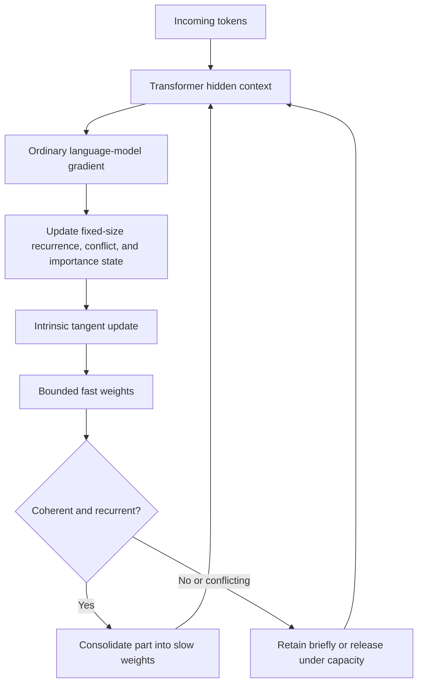

# Continual Learning Architecture

## Purpose And Scope

This document defines a proposed continual-learning architecture. It describes
the mechanism, state, mathematics, and system boundaries. It is not a run log
and does not claim that the complete architecture has already been validated at
scale.

The central proposal is:

```text
continual learning = weight-native evidence accumulation
                   + constrained weight motion
                   + context-specific conflict resolution
```

The architecture has three coupled parts:

1. **Implemented weight-native core.** Every model matrix has slow weights,
   bounded fast weights, and fixed-size metaplastic statistics. Recurrent,
   coherent gradients strengthen protection and consolidate; opposing gradients
   release protection; an intrinsic tangent update limits structural damage.
2. **Proposed context-conditioned extension.** A fixed number of fast-weight
   modes are addressed by the current hidden context. This is intended to bind
   a correction to the relation and context it changes instead of applying the
   same fast update globally.
3. **Extended evidence and manifold architecture.** A bounded evidence field
   and Functional-Manifold Transport provide a stronger but more expensive
   formulation for evidence organization, exact functional constraints, and
   transactional verification.

The implemented core answers how weights can continue changing without an
unbounded replay or anchor store. The context-conditioned extension addresses
where a change should apply. The extended architecture addresses stronger
evidence organization and verification. These levels must not be confused:
context-conditioned fast-weight modes are a design proposal, not a validated
result.

## Core Thesis

Continual learning is not primarily a sequence of independent writes. New data
can require the model to:

- reuse an existing computation;
- compose several existing concepts;
- extend an existing representation;
- add a relation between existing representations;
- form a genuinely new direction;
- branch because the new evidence contradicts an old state;
- leave an observation unresolved because it is not yet economical to encode;
- compress or release old structure when capacity becomes constrained.

Therefore, the learning problem is not:

```text
new sample -> choose learn or forget -> update weights
```

It is:

```text
new evidence
    -> explain it against the whole retained structure
    -> reorganize that structure under a capacity budget
    -> construct a consolidation objective
    -> move the main model through a protected parameter-space direction
    -> verify and commit the resulting structure
```

The mechanism does not use permanent `preserve`, `guard`, `drop`, or `new`
roles. Those labels are useful for controlled experiments, but they do not
scale into an autonomous architecture. Retention and forgetting instead emerge
from continuous evidence contribution, structural competition, contradiction,
recurrence, and capacity pressure.

## Non-Goals

This architecture is not:

- a neural controller wrapped around a frozen language model;
- a learned optimizer that emits arbitrary parameter updates;
- a classifier that assigns every sample a fixed semantic role;
- a rule table of `if/else` decisions;
- a replay system that stores every past token;
- a claim that hidden states must remain numerically frozen;
- a claim that all new observations should immediately change model weights.

The main model remains the system that learns language, concepts, relations,
and reusable computations. In the implemented core, metaplastic state changes
how native model weights learn. In the extended design, the evidence mechanism
organizes evidence and Functional-Manifold Transport executes the constrained
change.

## Two Phases

### 1. Foundation Sculpting

The model first learns a useful representation by ordinary training. During
this phase:

- the geometry is allowed to form globally;
- capacity statistics are measured;
- no aggressive forgetting is performed;
- no attempt is made to protect an immature representation as if it were final.

This avoids a feedback loop in which a weak early geometry protects itself and
prevents the model from becoming useful.

### 2. Continual Learning

Continual learning begins only after the foundation reaches a stable operating
region. Stability is a measured condition, not a fixed training step. It
includes:

- bounded change in validation behavior;
- bounded movement of representation statistics;
- sufficiently stable reusable features and relations;
- a usable estimate of free and occupied representational capacity.

In this phase, each observation can update lightweight metaplastic or evidence
state. Fast model state may change immediately within its budget, while slow
weights change only through consolidation.

## System Boundary

The currently implemented weight-native state at time `t` is:

```text
S_t = (theta_slow,t, Delta_theta_fast,t, Psi_t, B_t)
```

where:

- `theta_slow,t` is consolidated model knowledge;
- `Delta_theta_fast,t` is bounded, rapidly editable model state;
- `Psi_t` contains fixed-size row/column gradient moments, importance,
  conflict, sensitivity, and low-rank gradient-mode statistics;
- `B_t` is the explicit fast-state, step-size, and compute budget.

All of this state belongs to the model's update mechanism. There is no replay
list, protected-example list, semantic anchor table, or permanent role label in
the current weight-native experiment.

The proposed context-conditioned extension changes the fast state to:

```text
Delta_theta_fast,t = {Delta_theta_t^(1), ..., Delta_theta_t^(K)}
```

where `K` is a fixed capacity, not an ever-growing list of facts or roles. The
extended evidence/manifold formulation later in this document additionally
uses bounded evidence `M_t` and verified references `R_t`; those are not part of
the current weight-native implementation.

## Architecture Overview



This diagram describes the implemented core. Its important limitation is that
the current fast tensor is global: all contexts use the same
`theta_slow + Delta_theta_fast`. The following section explains why that is not
enough for reliable semantic replacement.

## Current Weight-Native Core

### What A Weight Contains

For every native matrix, the current implementation uses:

```text
W_effective = W_slow + W_fast
```

`W_slow` contains consolidated knowledge. `W_fast` is a bounded working area
where recent updates can be tested and accumulated. Recurrent and coherent
gradient directions transfer gradually from `W_fast` into `W_slow`. Conflicting
directions lower protection, and weak fast state is released when the global
fast-weight budget is full.

This is easiest to picture as one shared whiteboard attached to each matrix:

- new evidence writes on the whiteboard;
- repeated compatible evidence makes part of the writing permanent;
- conflicting or unused writing fades;
- the whiteboard has a fixed size;
- the tangent rule restricts writes that would strongly disturb important
  row/column structure.

The model does not know that a particular scalar weight means a person, place,
fact, or role. It observes distributed gradient patterns. A fixed-rank set of
left/right gradient modes summarizes update families that recur across a
matrix. These modes measure similarity between update directions; they are not
semantic memory slots and they do not currently select different effective
weights during inference.

### Intrinsic Tangent Update

Let `G` be the current gradient and `I` the factorized importance field. The
raw preconditioned learning direction is `D`. The structural normal is:

```text
N = I elementwise-multiplied-by W_effective
```

The updater removes row-wise and column-wise components of `D` aligned with
`N`, producing `D_tangent`. To first order, this reduces changes to important
row and column energy. A consequence gate then compares predicted learning gain
against predicted structural damage:

```text
gain   = positive_part(-<G, eta D_tangent>)
damage = measured first-order change of important row/column structure
gate   = gain / (gain + lambda damage + epsilon)
DeltaW = gate eta D_tangent
```

This is a weight-local geometry proxy. It is cheaper than the exact protected
behavior Jacobian used by the earlier Invariant-Tangent experiments, but it is
also weaker: it does not prove that a particular output relation is preserved.

## The Serious Missing Capability: Exact Semantic Replacement

Consider an old answer and a correction:

```text
old: Asha's office is in Delhi
new: Asha's office is now in Pune
```

The current model can repeatedly train on the correction and substantially
lower its language-model loss. That still does not guarantee:

```text
logit(Pune | Asha's office is in ...) > logit(Delhi | Asha's office is in ...)
```

The reason is structural, not merely a low learning rate. `W_fast` is shared by
every input. A correction gradient can improve the tokens `Asha`, `office`, and
`Pune`, while the older distributed route from the exact query to `Delhi`
remains stronger. It can also alter unrelated queries that use overlapping
features. Gradient-mode recurrence recognizes that a direction has appeared
before, but it does not bind that direction to the exact hidden context where
it should be active.

This is serious because continual learning requires more than lowering loss on
new text. For a true replacement, the architecture must establish all three:

1. the new answer wins in the intended context;
2. unrelated contexts using shared features remain valid;
3. the old answer is retained only where it is still contextually valid, or is
   actively suppressed where it has genuinely become obsolete.

The current weight-native core has not solved this. Its 1M-model correction
runs improved correction loss, but the old-answer margin remained negative.
That result must be read as a failed semantic-replacement gate, not as a solved
correction mechanism.

## Proposed Context-Conditioned Fast-Weight Modes

### Simple Meaning

Instead of one shared whiteboard, give each matrix a fixed number of small
drawers. The current hidden representation acts as an address. Only drawers
whose addresses match the current context contribute strongly to the matrix.

For the office example, a drawer can become associated with the distributed
context for `Asha + office + current location`. The Pune correction is then
active for that relation. A query about another person's office need not use
the same drawer. If Delhi remains valid in a historical context, the model can
keep a separate contextual branch instead of globally deleting it.

This is not a table with one drawer per fact. The number of drawers is fixed,
and each drawer represents a reusable low-rank update family shared by many
compatible contexts.

### Forward Mathematics

Let `h` be the hidden context entering a matrix. A model-native query and a
fixed-capacity bank of mode keys produce routing weights:

```text
q(h)  = normalize(P h)
a_k(h) = softmax_k(q(h)^T c_k / tau)
```

The effective matrix becomes:

```text
W_effective(h) = W_slow + sum_(k=1)^K a_k(h) DeltaW_k
```

For bounded storage, each mode may be low rank:

```text
DeltaW_k = U_k V_k^T
y = W_slow h + sum_(k=1)^K a_k(h) U_k(V_k^T h)
```

`K` and the total fast-weight norm are fixed capacity budgets. Keys `c_k`, the
query map `P`, and low-rank updates are model parameters or metaplastic state;
they are not assigned semantic labels by an external rule system.

### Update Mathematics

The current context routes its gradient into the same modes used by the
forward pass:

```text
G_k = a_k(h) G
D_k = intrinsic_tangent(G_k, importance_k)
DeltaW_k <- DeltaW_k - eta gamma_k D_k
```

`gamma_k` is the same gain-versus-damage gate used by the weight-native core,
computed per mode. Matching recurrent gradients strengthen a mode and make it
eligible for consolidation. Opposing gradients affect the matching mode rather
than releasing protection globally. Under capacity pressure, modes compete for
a fixed budget; weak, redundant, or consistently contradicted modes release
capacity.

The present global fast-weight mechanism is the special case `K = 1` with
`a_1(h) = 1` for every context.

### How A Replacement Would Proceed

A reliable correction needs a pending period rather than immediate global
overwrite:

```text
1. Route the correction into the mode matching its hidden relation and context.
2. Keep the candidate change in bounded fast state.
3. Accumulate recurrence, conflict, gain, damage, and source/evidence state.
4. Test the explicit new-versus-old answer margin in the matching context.
5. Test unrelated and protected behavior for damage.
6. Consolidate the contextual mode only after the replacement and protection
   conditions are both verified.
7. Release the old route only in contexts where supported replacement has been
   established; otherwise retain a contextual branch.
```

The measurements in steps 4 and 5 must be differentiable model measurements,
not hidden evaluation labels or hardcoded fact identities.

### What Context Conditioning Does Not Solve

Context routing answers **where** a weight change should apply. It does not, by
itself, answer **whether incoming text is true or authoritative**. Repeated
misinformation can look recurrent and coherent. No learning rule can infer a
universal truth distinction from identical raw observations alone.

Reliable replacement therefore requires evidence available in the learning
problem, such as supervised correction signals, source provenance, independent
agreement, temporal authority, or downstream verification. The architecture
may learn how those signals affect consolidation, but it cannot manufacture
missing evidence. When evidence is insufficient or conflicting, the correct
state is a bounded unresolved candidate, not forced learning or forced
forgetting.

Context-conditioned modes are therefore the next architectural hypothesis,
not a completed feature. They still require implementation and direct tests of
context-specific replacement, unrelated-context preservation, bounded mode
competition, and long-stream plasticity.

### Cost And Required Invariants

Context-conditioned modes change a normal linear layer into a routed low-rank
layer. Unlike one global `W_fast`, all contextual modes cannot be merged into a
single static weight matrix because their contribution depends on `h`. A
scalable implementation therefore needs sparse routing: compute all small key
scores, activate only a fixed small number of modes, and apply only those
low-rank updates.

The extension is valid only if all of these invariants hold:

1. **Fixed capacity.** The number and rank of modes remain bounded; no mode is
   created per sample or per fact.
2. **Context specificity.** Paraphrases of the same relation route similarly,
   while unrelated relations do not receive the correction.
3. **No mode collapse.** Routing does not send every input to one dominant
   mode, which would recreate the current global-fast-weight failure.
4. **Key transport.** As slow weights change hidden representations, mode keys
   move with the represented function or are revalidated; stale addresses must
   not silently route to the wrong update.
5. **Explicit replacement margin.** A correction is not considered learned
   merely because its token loss falls. The new answer must beat the old answer
   in the intended context.
6. **Protected spillover bound.** Applying a contextual mode must keep damage
   to unrelated contexts within an explicit measured limit.
7. **Bounded uncertainty.** Insufficient evidence remains pending within a
   fixed budget and eventually competes for release; it cannot accumulate
   forever.
8. **Visible failure.** Invalid routing, exhausted capacity, failed margins, or
   failed protection checks must defer or reject the update explicitly. They
   must not fall back to an unconstrained global write.

## Extended Architecture: The Evidence Field

The remainder of the evidence-field and Functional-Manifold Transport design is
the stronger extended architecture. It should not be read as already present
inside the current weight-native 1M experiment.

### Evidence Trace

An evidence trace is:

```text
T_i = (K_i, D_i, R_i, e_i, l_i, U_i, DeltaC_i)
```

where:

- `K_i` is a representation key or low-rank subspace;
- `D_i` is compressed supporting evidence, probes, or a data pointer;
- `R_i` stores relations to other traces;
- `e_i` is accumulated evidence mass, including unresolved observations;
- `l_i` is verified learned mass that may contribute protection;
- `U_i` contains usage, recency, and uncertainty statistics;
- `DeltaC_i` is the trace's marginal contribution to explaining retained data.

The trace is not necessarily one sample. It may represent:

- repeated paraphrases of the same fact;
- a concept prototype;
- a relation;
- a reusable computation;
- a contradictory branch valid in a specific context;
- an unresolved residual that has not earned durable structure.

### Bounded State

The evidence field is bounded:

```text
capacity(M_t) <= B_t
```

It cannot grow by storing every observation forever. Its purpose is to preserve
the smallest structure that still explains the evidence required for future
learning and verification.

The operational toy implementation maintains a fixed number of recurrent trace
slots. Each slot stores a mean, a compressed variance statistic, evidence mass,
and verified learned mass. Pending mass is explicit:

```text
p_i = max(0, e_i - l_i)
```

This separation is essential. A first unfamiliar observation may enter bounded
pending memory without receiving permission to modify the main model. Only
successful learning increases `l_i`, and only `l_i` can create durable
dependency protection. Empty slots remain explicit numerical null states; they
are not silently filled with fabricated evidence.

## Representing Incoming Data

For an observation `x_t`, the main model produces layerwise representations:

```text
q_t^(l) = f_theta^(l)(x_t)
```

The resolver can use a selected collection of residual-stream states, output
behavior, relation features, and uncertainty measurements. It does not require
the full activation tensor from every token and layer.

The representation is normalized with statistics in `Sigma_t`. Distances from
different layers or measurement types must not be compared in raw units.

For a measurement block `b`:

```text
q_tilde_t,b = Sigma_b^(-1/2) (q_t,b - mu_b)
```

This whitening prevents a numerically large block from dominating merely due
to scale.

## Evidence Attention

The incoming representation attends to the entire retrieved evidence set:

```text
s_ti = sim(q_t, K_i) + log(m_i + epsilon) + relation(q_t, R_i)

a_ti = exp(s_ti) / sum_j exp(s_tj)
```

This is attention over retained evidence, not a learned action policy. It gives
a continuous allocation of explanatory responsibility across existing traces.

The attention serves three purposes:

1. retrieve relevant prior structure;
2. measure whether existing structure can explain the observation;
3. distribute recurrence and contribution statistics across traces.

The evidence mass evolves continuously:

```text
e_i,t+1 = gamma_i,t e_i,t + a_ti
```

`gamma_i,t` is derived from the current bounded reorganization solution. It is
not a permanent class label. A trace can become stronger, merge into another
trace, lose independent value, or remain unresolved as future evidence arrives.

Verified learned mass is transported separately through the same soft slot
assignments:

```text
l_j,t+1 = sum_i gamma_i,t l_i,t c_i,t a_ij
          + sum_x w_x,t gain_x,t a_xj
```

where `c_i,t` is reconstruction confidence, `w_x,t` is model-write strength,
and `gain_x,t` is measured post-update learning gain. Evidence can therefore
survive provisionally without being mistaken for learned knowledge.

## Novelty Is A Residual, Not A Label

Calling every low-match observation "novel" is insufficient. A new observation
may be a recombination of known components rather than a new concept.

Let the retrieved evidence basis be:

```text
K = [K_1, K_2, ..., K_n]
```

Find the best existing composition:

```text
c_t = argmin_c ||q_t - Kc||_Sigma^2 + lambda_c Omega(c)

q_hat_t = K c_t

r_t = q_t - q_hat_t
```

`q_hat_t` is the part already explained by retained structure. `r_t` is the
unexplained residual. Only the residual is a candidate for new representational
structure.

This decomposition distinguishes:

- reuse: one existing trace explains the observation;
- composition: several traces jointly explain it;
- extension: a small residual consistently modifies an existing trace;
- relation: known objects are connected in a new way;
- contradiction: two incompatible outcomes share a context;
- genuine novelty: a persistent residual requires a new direction;
- unresolved evidence: dedicated structure currently costs more than it saves.

## Competing Structural Explanations

For each observation, the resolver constructs a set of representational
hypotheses `H_t`. A hypothesis is a proposed evidence organization, not an
action emitted by a controller.

Examples include:

```text
reuse existing structure
compose existing traces
extend a trace subspace
add a relation
create a contextual contradiction branch
allocate a new direction
retain only an unresolved residual
```

Each hypothesis has a total representational cost:

```text
C_h = C_structure(M_h)
    + C_residual(q_t | M_h)
    + C_conflict(M_h)
    + C_change(M_h, M_t)
```

The terms mean:

- `C_structure`: capacity consumed by keys, relations, probes, and subspaces;
- `C_residual`: unexplained information after applying the hypothesis;
- `C_conflict`: contradictions left without a contextual split;
- `C_change`: unnecessary churn of an already useful evidence organization.

### Cost Units

The costs must share one unit. The cleanest choice is encoded bits. For a
retrieved set of normalized representations `Q` and trace subspaces `K_i`, a
concrete residual cost is:

```text
C_residual(Q | M)
  = 1 / (2 ln 2)
    sum_t sum_i a_ti
    ||q_t - K_i c_ti||_(Sigma_i^-1)^2
    + C_noise(Sigma)
```

The structural cost is the measured encoding required by the retained state:

```text
C_structure(M)
  = bits(keys)
  + bits(subspace factors)
  + bits(relations)
  + bits(probes and sufficient statistics)
```

The conflict cost is the extra residual needed when one trace predicts
incompatible outcomes in the same context. A contextual branch reduces this
term only when its context key explains the separation.

The change cost encodes evidence-field churn:

```text
C_change(M', M)
  = bits(additions)
  + bits(removals)
  + bits(reassigned relations)
```

Compute can be included through its measured equivalent budget cost. These are
observable storage, residual, and compute quantities. They are not manually
assigned semantic scores such as "important" or "safe."

The relative support for a hypothesis is:

```text
p(h | q_t, M_t) = 2^(-C_h) / sum_j 2^(-C_j)
```

This normalized allocation is not a claim of Bayesian inference. It is a
cost-derived competition rule: explanations that represent the evidence more
compactly receive more mass.

The next evidence field is the bounded organization with the lowest total cost:

```text
M_t+1 = argmin_M C_structure(M) + C_data(Q_1:t | M) + C_change(M, M_t)

subject to capacity(M) <= B_t
```

In practice this global problem must be approximated with sparse retrieval,
local merges, low-rank subspace updates, and periodic compression. Those
approximations must expose their error; they must not silently substitute a
different rule.

## How Novel Data Enters

Novel data does not automatically become durable knowledge, and it does not
automatically wait for a fixed number of repetitions.

A single observation can be integrated immediately when it:

- closes a large unexplained residual;
- establishes a low-cost relation among existing concepts;
- resolves a contradiction with strong contextual evidence;
- substantially reduces the total representation cost.

Repeated evidence matters when a new direction has an initial structural cost.
As support accumulates, the residual cost avoided by representing it can exceed
the cost of creating that structure.

Noise behaves differently. It may have a large instantaneous residual, but if
it does not recur, connect, predict, or compress other evidence, its marginal
contribution remains low. It can therefore remain transient and disappear when
the bounded evidence field is reorganized.

No fixed waiting period is required. Persistence follows from accumulated
explanatory contribution.

### Delayed Model-Write Strength

Evidence admission and model writing are different operations. For current
evidence `x`, let `f_x` be reconstruction familiarity with the prior trace
field, `r_x` be recurrence inside the current event, and let trace maturity be:

```text
u_i = 1 - exp(-e_i / m_scale)
```

The delayed support retrieved from prior traces is:

```text
s_x = f_x sum_i a_xi u_i
```

The operational model-write strength is:

```text
w_x = 1 - (1 - s_x)(1 - r_x)
```

For a singleton event, `r_x = 0` by definition. A genuinely unfamiliar first
observation can therefore have `w_x` near zero while still adding evidence mass
to the bounded trace field. If matching evidence returns later, its prior trace
maturity raises `s_x` and the model-write strength increases. Isolated noise
does not receive that delayed support and remains effectively unwritten.

After the candidate update, verified gain is measured per observation:

```text
gain_x = clip((error_before_x - error_after_x) / error_before_x, 0, 1)
```

Only `w_x gain_x` contributes new verified learned mass. This prevents a trace
from becoming protected merely because it was observed or because an update was
attempted.

## Contradiction And Revision

Contradiction is not treated as immediate overwrite.

Suppose an old trace predicts `y_old` and new evidence supports `y_new` in a
related context. The evidence field first tries to explain both using context:

```text
T_context -> {T_old, T_new}
```

If context separates the outcomes, both branches can remain. If the old branch
has been replaced across its valid context and no longer contributes useful
predictions, its marginal value falls under capacity competition.

For an explicitly superseded answer, controlled suppression uses a relative
margin:

```text
m_old(theta) = z_old(theta) - z_new(theta)

L_forget(theta) = max(0, m_old(theta) - m_target)
```

This lowers the obsolete answer relative to its replacement. It does not erase
unrelated behavior. When there is no supported replacement or contextual
resolution, the system retains the conflict as unresolved evidence rather than
inventing a deletion decision.

## Retention, Compression, And Forgetting

### Marginal Contribution

The contribution of trace `T_i` is:

```text
DeltaC_i = C_data(Q | M without T_i) - C_data(Q | M)
```

A large positive `DeltaC_i` means removing the trace would make the retained
evidence substantially harder to explain. A small value means the trace is
redundant, isolated, or already represented by shared structure.

### Capacity Rule

Before capacity pressure, the architecture does not force deletion merely to
make the state sparse. Compression and forgetting become active when the
bounded optimization must trade structures against one another:

```text
min_M C_structure(M) + C_data(Q | M)

subject to capacity(M) <= B_t
```

The available operations are:

- merge redundant traces;
- factor a shared feature or computation;
- compress overlapping subspaces;
- replace several examples with a sufficient probe;
- branch a contradiction by context;
- release a low-contribution trace;
- allocate a new plastic direction;
- rewire relations around a representational collision.

Forgetting is therefore not "make weak weights weaker." Weight magnitude alone
does not reveal functional importance. Forgetting means that a structure loses
independent explanatory contribution and is removed or absorbed during a
capacity-constrained reorganization.

### Continuous Retention Mass

The evidence field may expose normalized retention mass:

```text
pi_i = DeltaC_i^+ / sum_j DeltaC_j^+
```

for the active evidence set. `pi_i` is not a permanent role. It changes as new
data alters recurrence, redundancy, conflict, and shared structure.

## From Evidence To A Learning Objective

The evidence organization produces a compact consolidation set:

```text
D_t = {(D_i, pi_i, R_i)} for active traces i
```

The continual-learning objective is:

```text
L_CL(theta) = sum_i pi_i L_fit(theta; D_i, R_i)
            + L_relation(theta; M_t)
            + L_forget(theta; M_t)
```

where:

- `L_fit` consolidates retained and newly supported evidence;
- `L_relation` preserves or creates reusable relations and compositions;
- `L_forget` suppresses only structurally superseded behavior.

The raw learning gradient is:

```text
g_CL = grad_theta L_CL(theta)
```

This gradient contains the desired new learning, but using it directly can
overwrite established behavior and geometry. The update executor therefore
constrains its direction.

## When Model Weights Change

Evidence can update on every observation. Main-model weights do not need to.

Unresolved or weakly supported evidence may remain available to the current
context or an external short-term memory without entering durable weights. This
is the in-context path. Evidence enters the continual-learning path only when a
consolidated model state reduces the complete representation and update cost.
The two modes can therefore coexist without treating every inference as a
training event.

The architecture compares two candidate next states:

```text
J_evidence = total cost with reorganized evidence and unchanged theta

J_weight = minimum total cost after paying for a constrained weight update
```

The weight-update cost includes:

- parameter movement;
- protected-manifold disturbance;
- compute required for the update and verification;
- additional evidence memory that remains afterward.

Weight reorganization is selected only when the complete `J_weight` solution is
better than retaining the evidence transiently. This is an event-triggered
mathematical choice, not a fixed update interval or semantic rule.

## Protected Measurements

Established high-contribution evidence defines functions that should remain
stable during the next update. Protection is divided into three classes because
they must not move under the same rule.

### Immutable Functional Targets

These define what must continue to work:

- output logits or distributions on compact probes;
- answer margins;
- relational outputs;
- reusable computation or route responses;
- neutral behavior that must not change during targeted forgetting.

Their target values remain fixed until explicit replacement, contextual
branching, or release is verified. They are not moved merely because the model
has drifted.

### Transportable Functional Geometry

Internal geometry is protected only where it supports retained function. For
selected hidden states `H_l`, construct a readout-sensitive basis `R_l` from
gradients of protected target and competitor outputs with respect to those
states. The projector is:

```text
P_l = R_l R_l^T
```

The protected and free components are:

```text
H_parallel = H_l P_l
H_null     = H_l (I - P_l)
```

The bounded reference stores relational geometry in the protected component,
not every activation coordinate:

```text
G_l = normalize(center(H_l R_l) center(H_l R_l)^T)
```

`G_l` is invariant to rotations inside the selected readout basis. Drift in
`H_null` is allowed unless it changes an immutable functional target.

### Diagnostic Geometry

Full-state CKA, centroid drift, effective rank, and residual-stream drift are
measured for scientific diagnosis. They are not global acceptance barriers.
A fixed CKA floor can reject a valid function-preserving reparameterization and
therefore must not define the protected manifold.

For trace `i`, let:

```text
phi_i(theta)
```

be its protected measurement and let:

```text
phi_i_ref
```

be the value stored at the last verified commit.

For immutable measurement `i`, the normalized residual is:

```text
r_i(theta) = N_i [phi_i(theta) - phi_i_ref]
```

`N_i` whitens or block-normalizes the measurement. Behavior, guard, relation,
and readout-sensitive geometry blocks must contribute on comparable scales.

The protected set is not chosen by a manual behavior label. Evidence traces
contribute measurements according to their current retained contribution and
the available constraint budget.

## Protected Jacobian Basis

For scalar normalized invariant components `c_i(theta)`, construct:

```text
A_t = [sqrt(pi_1) grad c_1(theta)^T
       sqrt(pi_2) grad c_2(theta)^T
       ...
       sqrt(pi_k) grad c_k(theta)^T]
```

`A_t` describes parameter-space directions that would change retained
measurements to first order.

A full Jacobian is not required. The operational basis can be:

- block-local by layer or module;
- restricted to an editable low-rank parameter subspace;
- compressed by weighted SVD or randomized range finding;
- cached until geometry changes enough to invalidate it;
- built from Jacobian-vector and vector-Jacobian products.

The basis rank is bounded by the explicit compute and memory budget. Rows are
selected by retained contribution and independent constraint information. Near
duplicate rows are compressed rather than accumulated forever.

### Functional Dependency Field

The extended dependency-field prototype does not identify semantic memory
weights. It constructs local functional dependencies. For protected trace `j`:

```text
J_j = partial phi_j(theta) / partial theta
```

Direct rows measure protected target and competitor output sensitivity. A
second sensitivity matrix is formed from the gradients of those outputs with
respect to hidden representations. Weighted SVD identifies readout-sensitive
feature-family directions, which are then differentiated back into parameter
space. Direct behavior rows, readout-family rows, and relational Gram residuals
are block-normalized and compressed by retained singular-value energy.

This produces a low-rank parameter consequence basis. It answers which joint
parameter directions locally support retained functions. It does not claim to
discover named neurons, globally causal circuits, or a permanent mapping from
one fact to one weight.

### Dependency Utility And Trace Survival

The extended feedback candidate closes the previously one-way coupling. Let
`d_all` be the candidate update when every current trace contributes protection,
and let `d_-j` be the candidate update when trace `j` is removed from the
constraint and restore basis. The release consequence is:

```text
D_j_direct = [L_j(theta - eta d_-j) - L_j(theta - eta d_all)]_+

D_j_down = sum_(k != j) q_k
           [L_k(theta - eta d_-j) - L_k(theta - eta d_all)]_+
           / sum_(k != j) q_k
```

Exact virtual updates are used only as a tiny-model calibration oracle. The
operational estimate linearizes each protected output with its trace-indexed
Jacobian:

```text
phi_k(theta - eta d) ~= phi_k(theta) - eta J_k d
```

Each trace also receives evidence contribution `E_j` from leave-one-trace-out
reconstruction error, verified learned fraction `V_j`, dependency centrality
`C_j`, and incoming conflict `X_j`. After RMS normalization by component, the
continuous utility is:

```text
u_j = a_E E_j + a_V V_j + a_D D_j_direct
    + a_G D_j_down + a_C C_j - a_X X_j
```

No semantic preserve/drop label appears in this equation. Under survival budget
`B`, a shared threshold `lambda` is solved by bisection:

```text
s_j = sigmoid((u_j - lambda) / T)
sum_j s_j = B
```

The allocated survival `s_j` continuously rescales both recurrent evidence mass
and verified learned mass. Dependency rows are then rebuilt from the surviving
state before the actual Functional-Manifold Transport update:

```text
trace state
    -> trace-indexed dependency blocks
    -> predicted direct and downstream release consequence
    -> budgeted continuous survival
    -> revised trace state and dependency basis
    -> constrained update and verification
```

This feedback operator is implemented in the tiny experiment, but its scientific
status is still partial. It must show on the full delayed stream that rare
functionally central traces survive, obsolete traces release, pending mass is
reduced, and first-order consequence remains calibrated. The utility coefficients
and budget are explicit control parameters; they are not claimed to be universal.

## Functional-Manifold Transport

Let the complete immutable protected measurement vector be `C(theta)` with
verified target `C_star`. The functional equivalence set is the level set:

```text
M = {theta : C(theta) = C_star}
```

Its local Jacobian is:

```text
J_t = partial C(theta_t) / partial theta
```

The local tangent space is `ker(J_t)`. If the model has `p` editable parameters
and `rank(J_t) = r`, the first-order free dimension is:

```text
dim(T_theta M) = p - r
```

Learning is locally possible only when the new-learning gradient has a nonzero
component in that tangent space:

```text
||P_ker(J_t) g_CL|| > 0
```

This is the measurable plasticity condition. A low CKA value does not imply
that the condition failed, and a high CKA value does not imply that protected
function survived.

### Normal Repair And Tangent Learning

For protected residual:

```text
r_t = C(theta_t) - C_star
```

the local normal repair is:

```text
n_t = -J_t^T (J_t J_t^T + rho I)^(-1) r_t
```

The tangent component of the new gradient is:

```text
g_tangent = g_CL
          - J_t^T (J_t J_t^T + rho I)^(-1) J_t g_CL
```

Projection plus bounded restore remains a useful diagnostic decomposition and a
special-case implementation. It is no longer the normative update operator,
because independently composing those two vectors can violate hard constraints
after trust-region clipping.

### Unified Constrained Step

The operational update solves normal repair, tangent learning, soft compressed
dependencies, and hard functional barriers together:

```text
delta_t = argmin_delta
    g_CL^T delta
  + 1/2 delta^T B_t delta
  + lambda_soft ||S_t delta - b_soft||^2

subject to
    H_t delta >= b_hard
    ||delta|| <= Delta_t
```

where:

- `B_t` is a positive-definite local metric or trust-region curvature model;
- `S_t` is the bounded low-rank dependency sketch;
- `H_t` contains hard behavior margins, guard-loss ceilings, and active
  functional-geometry barriers;
- `Delta_t` is the adaptive trust radius.

The guard-loss ceiling is itself differentiable. For maximum allowed guard loss
`L_max`, define protected measurement `m_guard = -L_guard`. Its linearized hard
constraint is:

```text
-grad L_guard(theta_t)^T delta
    >= L_guard(theta_t) - L_max
```

This prevents a long inner optimization from repeatedly crossing the guard
ceiling and being rejected only after the damage has occurred.

The solve must report infeasibility. Trust-region clipping must not silently
convert an infeasible protected step into ordinary training.

### Basis Transport Without Target Laundering

After a candidate passes immutable behavior, margin, guard, and relational
geometry checks, the readout-sensitive basis may move with the verified model.
For old basis `R_t` and newly measured basis `R_hat`, an online subspace update
can be written:

```text
R_t+1 = qf(R_t + eta_R (I - R_t R_t^T) R_hat)
```

The operational implementation recomputes a bounded protected-readout basis
after each accepted transaction. Only the basis and its relational Gram target
are transported. Immutable output and margin targets do not move merely because
the candidate changed them. This distinction prevents reference laundering.

### Geometry May Reorganize

The architecture protects selected functions and readout-sensitive relations
while allowing other coordinates to move. Acceptable changes include basis
rotations, redistribution across redundant neurons, new null-space directions,
rank growth, centroid relocation, and rewiring that preserves required output
relations. The desired result is coherent functional geometry change, not zero
hidden-state change.

## Verification And Commit

The candidate model is evaluated against the evidence organization that
generated the update.

Verification measures:

- fit of newly consolidated evidence;
- immutable behavior and margin targets;
- guard loss against its explicit ceiling;
- readout-sensitive relational distortion;
- readout-range and readout-null drift separately;
- relational and composition behavior;
- success of targeted obsolete-answer suppression;
- capacity and compute cost;
- actual versus predicted update damage.

The accepted state minimizes the same explicit constrained objective used to
construct the candidate. An implementation must expose a failed constraint or
rejected update. It must not silently commit a degraded state.

After a verified commit:

```text
theta_t+1 = theta_candidate

phi_new_ref = phi_new(theta_t+1)
R_t+1 = transport_readout_basis(R_t, theta_t+1)
G_t+1 = relational_gram(theta_t+1, R_t+1)
```

for newly committed measurements and the transportable geometry reference.
Established immutable behavior and margin targets remain unchanged unless an
explicit verified replacement or contextual branch changes their status.

If no feasible protected path exists, the system must not force an overwrite.
It can retain the evidence transiently, reorganize the evidence field, allocate
capacity, create a contextual branch, or expose the conflict for arbitration.

The extended prototype makes verification transactional with explicit
backtracking. It snapshots the parameters, applies the unified constrained
step, and accepts only a candidate that improves new learning while satisfying
immutable guard, margin, and functional-geometry conditions. If no tested step
is feasible, parameters are restored and the failure is recorded. A
numerically zero model-write event is an explicit defer operation: evidence is
admitted to pending memory, but no weight update is attempted.

## Recursive Plasticity

After each successful consolidation:

1. new supported structure becomes part of the evidence field;
2. its verified behavior and relations become candidate protected measurements;
3. redundant old probes are compressed;
4. the next update protects both established and newly committed computation;
5. obsolete structure can lose contribution as replacements become established.

Plasticity is preserved because constraints are not allowed to accumulate as
independent rows forever. They are weighted, merged, and compressed with the
same capacity logic as evidence traces.

The loop is recursive:

```text
learn -> verify -> commit -> compress -> use as prior structure -> learn again
```

## Composition And Computation Reuse

The architecture should prefer reuse when new evidence can be represented by
existing features and relations.

For a candidate composition:

```text
q_hat = sum_i c_i K_i
```

If the residual is small, the evidence field stores the composition or relation
rather than creating a duplicate concept. If a shared residual recurs across
many traces, it can be factored into a reusable feature.

This supplies a mathematical route to:

- reuse existing computation;
- compress repeated structure;
- add relations without duplicating objects;
- increase sparsity through factorization;
- reserve new directions for genuinely unexplained information.

Composition generalization remains a separate capability from memory
preservation. Preserving old behavior does not prove that the model can infer an
unseen composition.

## Rewiring

Rewiring is not random mutation of individual neurons. It is a change in the
mapping between evidence subspaces and editable model routes when the current
route creates a collision.

A rewiring candidate must reduce:

```text
C_residual + C_conflict + C_capacity
```

while satisfying the protected invariant constraints. It can be implemented
as:

- opening an unused low-rank route;
- moving a feature into a less-colliding subspace;
- factoring one overloaded route into shared and specific components;
- changing sparse connectivity while preserving the measured function.

The rewire is verified through behavior and geometry. A topology edit by itself
is not evidence of useful rewiring.

## Capacity Measurement

Capacity is not a universal token-per-parameter constant. It depends on data
entropy, redundancy, sequence construction, model shape, optimization, and the
required error tolerance.

Useful workload measurements include:

```text
rho_token = T / P

N_pos = number of supervised next-token positions

rho_pos = N_pos / P
```

where `T` is token count and `P` is trainable parameter count.

Geometry measurements include effective rank:

```text
p_j = sigma_j^2 / sum_k sigma_k^2

r_eff = exp(-sum_j p_j log p_j)
```

and representation similarity such as linear CKA:

```text
CKA(X, Y) = ||X^T Y||_F^2
          / (||X^T X||_F ||Y^T Y||_F)
```

Runtime capacity pressure should combine:

- evidence-field occupancy;
- unresolved residual mass;
- constraint-basis rank;
- representational collision;
- update cost;
- degradation of held-out behavior.

Accuracy alone is insufficient because capacity pressure can rise before a
visible behavioral collapse.

## Scaling Strategy

The architecture must not maintain a state entry for every parameter or compare
every observation with every old sample.

The scalable hierarchy is:

```text
observation evidence
    -> concept or relation trace
    -> feature subspace
    -> layer or module
    -> low-rank editable parameter route
```

The main approximations are:

- sparse evidence retrieval;
- prototype and sufficient-statistic compression;
- low-rank keys and relation factors;
- block-local protected Jacobians;
- Jacobian-vector products instead of materialized full Jacobians;
- cached constraint bases with explicit invalidation;
- event-triggered weight consolidation;
- bounded verification probes.

Each approximation must report approximation error or lost coverage. There are
no hidden fallbacks to unconstrained training.

## Complete Mathematical Loop

For each observation `x_t`:

```text
1. Represent
   q_t = f_theta_t(x_t)

2. Retrieve and explain
   c_t = argmin_c ||q_t - K_t c||_Sigma^2 + lambda_c Omega(c)
   r_t = q_t - K_t c_t

3. Construct competing evidence organizations
   H_t = {reuse, compose, extend, relate, branch, new-direction, unresolved}

4. Reorganize bounded evidence
   M_t' = argmin_M C_structure(M)
                     + C_data(Q_1:t | M)
                     + C_conflict(M)
                     + C_change(M, M_t)
   subject to capacity(M) <= B_t

5. Separate evidence from model writing
   update evidence mass e_i for admitted observations
   compute delayed support s_x from prior trace maturity
   compute model-write strength w_x

6. Compare transient and consolidated states
   J_evidence = J(theta_t, M_t')
   J_weight   = min_delta J(theta_t + delta, M_t') + C_update(delta)

7. If the weight-reorganized state is selected, consolidate
   L_CL = sum_x w_x L_fit(theta; x)
        + L_relation
        + L_forget
   g_CL = grad_theta L_CL

8. Build functional constraints
   J_t = normalized Jacobian of immutable behavior and margins
   S_t = compressed readout-sensitive dependency sketch
   H_t = hard margins, guard ceiling, and active geometry barriers

9. Solve one constrained normal-tangent step
   delta_t = argmin_delta g_CL^T delta
                           + 1/2 delta^T B_t delta
                           + lambda_soft ||S_t delta - b_soft||^2
   subject to H_t delta >= b_hard and ||delta|| <= Delta_t

10. Apply transactionally
    theta_candidate = theta_t + delta_t

11. Verify
    measure evidence fit, immutable behavior and margins, guard loss,
    readout-sensitive relational distortion, targeted forgetting,
    capacity, and actual damage

12. Commit and transport atomically
    increase verified learned mass by w_x gain_x
    update theta, evidence traces, compressed constraint basis,
    newly committed functional targets, and readout-sensitive geometry basis
```

Steps 1 through 5 are the autonomous evidence mechanism. Steps 7 through 10 are
the model-update mechanism. They are coupled through `M_t'`, continuous write
and protection mass, and the protected measurement basis.

## Operational Pseudocode

```text
state = (theta, evidence, references, budget, normalization)

for observation in stream:
    representation = encode_with_main_model(theta, observation)

    retrieved = sparse_retrieve(evidence, representation)
    explanation = residual_decompose(representation, retrieved, normalization)

    proposed_evidence = solve_bounded_reorganization(
        evidence,
        observation,
        explanation,
        budget,
    )

    transition = compare_state_descriptions(
        theta,
        evidence,
        proposed_evidence,
        references,
        budget,
    )

    if transition.requires_weight_reorganization:
        objective = build_consolidation_objective(proposed_evidence)
        raw_gradient = differentiate(objective, theta)

        constraints = build_functional_constraints(
            theta,
            proposed_evidence,
            references,
            budget,
        )

        delta = solve_normal_tangent_trust_region(
            theta,
            raw_gradient,
            constraints,
            references,
        )

        candidate = apply_update(theta, delta)

        verification = verify(
            candidate,
            proposed_evidence,
            constraints,
            budget,
        )

        state = commit_transport_or_reject_atomically(
            state,
            candidate,
            verification,
        )
    else:
        evidence = proposed_evidence
```

Every operation above has an explicit mathematical input and output. A failed
solve, invalid measurement, unavailable constraint basis, or failed verification
must be surfaced as an error. The implementation must not hide it behind an
unconstrained update.

## Diagnostics

The architecture should report, per consolidation event:

### Evidence

- explained versus residual representation energy;
- mass assigned to reuse, composition, extension, branching, new direction,
  and unresolved evidence;
- trace merges, factors, branches, and releases;
- marginal contribution distribution;
- evidence occupancy and unresolved residual pressure.

### Update

- raw gradient norm;
- normal repair and tangent-learning contributions;
- usable tangent-gradient fraction;
- protected basis rank and condition number;
- active hard constraints and minimum slack;
- trust radius and clipping scale;
- predicted protected change `||J_t delta_t||`;
- actual protected residual after the candidate step.

### Behavior And Geometry

- retained and new behavior loss;
- guard loss and guard ceiling;
- targeted obsolete-answer margin;
- residual-stream drift;
- readout-sensitive relational distortion;
- readout-range and readout-null drift;
- CKA and effective-rank change as diagnostics;
- centroid and separation change;
- reusable relation and composition behavior.

### Capacity And Compute

- evidence memory;
- constraint memory;
- update FLOPs and wall time;
- verification cost;
- number of observations per weight consolidation;
- rejected or infeasible updates.

## Architectural Invariants

The implementation must maintain these invariants:

1. Evidence organization and model-weight learning are distinct operations.
2. Novelty is measured as unexplained residual after reuse and composition.
3. Repetition influences evidence mass but is not the only route to retention.
4. Forgetting begins from capacity competition or supported replacement, not
   weight magnitude alone.
5. Protected measurements are normalized and weighted by retained contribution.
6. Normal repair, tangent learning, soft dependencies, and hard barriers are
   resolved by one explicit trust-region solve.
7. Guard behavior is constrained inside the solve, not only checked afterward.
8. Successful new knowledge transports readout-sensitive geometry only after
   immutable functional checks pass.
9. Constraint memory is compressed so protection does not eliminate plasticity.
10. CKA and full-state drift are diagnostics, not immutable global barriers.
11. No failed solve or failed verification silently becomes ordinary training.
12. Evidence admission, model writing, and verified learned mass are distinct.
13. Hidden evaluation labels never determine write, protection, or release.

## Current Scientific Status

The project currently contains two experimentally distinct mechanisms. Their
status must remain separate:

| Mechanism | Status | What has been shown | What has not been shown |
| --- | --- | --- | --- |
| Earlier Invariant-Tangent and Functional-Manifold Transport | Working in controlled toy and bounded 1M experiments | Protected behavior and measured geometry can constrain weight motion; verification and rollback can reject damage | Cheap deployment at scale and autonomous construction of all protected measurements |
| Weight-native slow/fast matrices | Implemented on the 1M transformer | Continual language-model updates, bounded fast state, guard retention, geometry retention, capacity enforcement, recurrence, conflict, and consolidation operate without replay lists or semantic role labels | Reliable context-specific fact replacement |
| Global fixed-rank gradient modes | Implemented | Recurrent and opposing update families can be detected with fixed-size state | The modes do not select different forward behavior by context |
| Context-conditioned fast-weight modes | Proposed only | The equations and required invariants are specified above | No implementation or experimental evidence yet |

The present weight-native model uses one global `W_fast` per matrix. In its
single-seed 1M tests, learning, guard, geometry, capacity, and misinformation
gates passed. Correction loss improved substantially, including under repeated
confirmation, but the explicit new-answer-versus-old-answer margin remained
negative. Therefore:

```text
bounded continual weight motion: working in the tested setting
autonomous recurrence/conflict state: working as a coarse signal
exact semantic replacement: unsolved
context-conditioned fast modes: proposed next mechanism
general continual learning: not established
```

The correction failure is not hidden by the lower correction loss. It means the
architecture can learn features of the incoming correction without yet making
that correction the model's preferred answer in the exact conflicting context.
This distinction is a required acceptance condition for future experiments.

The extended evidence field and Functional-Manifold Transport remain a research
lineage and a possible stronger verification layer. They are not silently
claimed as components of the current weight-native implementation.

Multi-seed robustness, long real streams, context-specific replacement,
held-out generalization, source reliability, and practical large-model compute
remain unproven.

The authoritative evidence and unresolved-work tables live in
`CL_PROGRESS.md`. Numerical run records live in `run_results.md`. Historical
exploration is archived under `docs/archive/` and is not part of the current
claim.

## Compact Definition

The full proposal can be stated in one paragraph:

> Each native model matrix is divided into consolidated slow weights and a
> bounded fast learning state. Fixed-size metaplastic statistics measure
> recurrence, sensitivity, conflict, and importance directly from gradient and
> weight history. An intrinsic tangent operator removes locally damaging update
> components; coherent fast changes consolidate into slow weights, while
> conflicting or weak changes release capacity. Because one global fast matrix
> cannot reliably bind a correction to one exact relation, the proposed next
> extension replaces it with a fixed number of context-addressed low-rank fast
> modes. Those modes would localize learning and forgetting, but they still need
> explicit evidence and verification to distinguish a supported correction from
> repeated misinformation. The bounded evidence field and Functional-Manifold
> Transport remain the stronger extended formulation for autonomous evidence
> organization and exact functional constraints.
