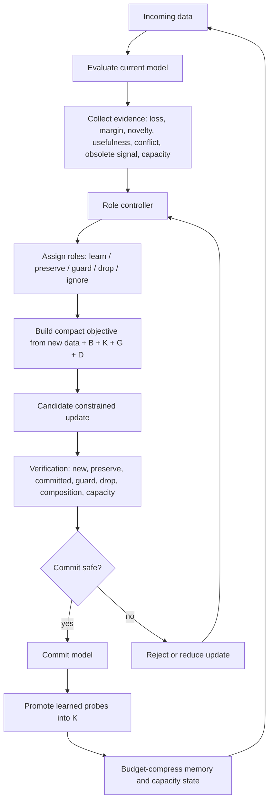

# Controlled Continual Learning Architecture

Local architecture ledger for the current continual-learning design.

This document describes the architecture only. It does not report experiment
scores, run outcomes, or claims of scalability.

## Section Chooser

- [Core Thesis](#core-thesis)
- [System Boundary](#system-boundary)
- [Two Training Phases](#two-training-phases)
- [Full State](#full-state)
- [End-To-End Loop](#end-to-end-loop)
- [Role Controller](#role-controller)
- [Evidence Map](#evidence-map)
- [Role Assignment](#role-assignment)
- [Behavior Memory](#behavior-memory)
- [Controlled Learning Objective](#controlled-learning-objective)
- [Drop And Forgetting Policy](#drop-and-forgetting-policy)
- [Neutral Guardrail](#neutral-guardrail)
- [Recursive Rebasing Loop](#recursive-rebasing-loop)
- [Dynamic Committed Memory](#dynamic-committed-memory)
- [Plastic Adapter Path](#plastic-adapter-path)
- [Verification And Commit](#verification-and-commit)
- [Capacity Management](#capacity-management)
- [Storage Frontier Equations](#storage-frontier-equations)
- [Computation Reuse](#computation-reuse)
- [Composition Generalization](#composition-generalization)
- [Compact Mathematical Loop](#compact-mathematical-loop)
- [Invariant-Tangent Update](#invariant-tangent-update)
- [Current Toy Implementation Details](#current-toy-implementation-details)
- [Researcher Questions And Current Answers](#researcher-questions-and-current-answers)
- [What Must Stay Conservative](#what-must-stay-conservative)
- [Target Architecture](#target-architecture)

## Core Thesis

Continual learning is not only a write problem.

It is:

```text
behavior-preserving representational change under finite capacity
```

The model must learn new data while deciding:

```text
what to preserve
what to guard
what to update
what to reuse
what to forget
what to leave untouched
```

The central loop is:

```text
observe -> assign roles -> learn -> verify -> commit -> protect committed knowledge
```

The model is not trusted to freely decide what to delete. The learning system
uses a hybrid control structure:

```text
model proposes
evidence scores constrain
hard safety policy verifies
only then updates commit
```

The important rule is:

```text
if uncertain, guard instead of drop
```

## System Boundary

The architecture is a continual-learning loop around a neural model.

The current form contains:

```text
core model
role controller
behavior memory
guard memory
committed learned memory
drop candidates
learning objective
verification checks
capacity manager
optional plastic adapter
consolidation step
```

The final target is a more model-native version, but the control structure
should remain conservative. The reasoner may score and propose, but deletion
and destructive rewrites require explicit evidence and verification.

The architecture should not hide errors or silently fall back. If a required
role group, memory group, checkpoint, tokenizer, or verification signal is
missing, the run should fail clearly.

## Two Training Phases

The design separates ordinary representation formation from continual-learning
control.

### Phase 1: Sculpting / Foundation

The model first learns enough base structure to make meaningful behavior and
geometry measurements possible.

During this phase:

```text
learn normally
do not aggressively protect
do not aggressively forget
do not run destructive role decisions
collect basic behavior and activation statistics
```

The goal is not continual learning yet. The goal is to form usable circuits.

Entering the continual-learning phase too early is dangerous because the model
has no stable behavior to protect and no reliable evidence about what matters.

### Phase 2: Controlled Continual Learning

Once behavior is stable enough, new data is handled by the CL loop.

During this phase:

```text
assign preserve / guard / drop / learn roles
train on new data
distill selected preserved behavior
guard uncertain old behavior
optionally suppress explicit drop behavior
verify after update
refresh memory
repeat
```

The continual-learning phase is where reasoning, role assignment, capacity
management, controlled forgetting, and consolidation happen.

## Full State

At step `t`, the architecture state is:

```text
Omega_t = {
  theta_t,      core model parameters
  B_t,          behavior memory
  G_t,          neutral guard memory
  K_t,          committed learned memory
  D_t,          drop candidate memory
  R_t,          role table
  E_t,          evidence table
  C_t,          capacity state
  U_t,          usefulness state
  A_t,          optional topology / route state
  Z_t,          optional recurrent controller state
  V_t           verification state
}
```

Meaning:

```text
theta_t  current model
B_t      behaviors that must be preserved
G_t      behaviors not explicitly preserved but not safe to damage
K_t      newly learned behaviors that passed verification and are now protected
D_t      behaviors eligible for forgetting
R_t      current role assignment for known behaviors or routes
E_t      frequency, recency, loss, usefulness, conflict, obsolete evidence
C_t      free, used, protected, overloaded, obsolete capacity estimates
U_t      utility estimates for behavior and computation reuse
A_t      optional route/topology ownership map
Z_t      optional recurrent memory for the role controller
V_t      canary, margin, KL, accuracy, geometry, and damage checks
```

The minimal toy version can operate with only:

```text
theta_t, B_t, G_t, K_t, D_t, R_t, E_t, V_t
```

The larger architecture adds topology, capacity, route ownership, and
recurrent state.

## End-To-End Loop

For incoming data `X_new`, the loop is:

```text
1. evaluate current model
2. collect evidence
3. assign behavior/route roles
4. build training objective
5. train candidate update
6. verify old/new/drop/guard behavior
7. accept, reject, or reduce update
8. refresh behavior memory
9. update capacity and usefulness state
10. continue
```

In compact form:

```text
E_t = observe(theta_t, X_new, B_t, G_t, D_t, R_t, C_t)
R_{t+1} = role_controller(E_t, policy)
theta'_t = learn(theta_t, X_new, R_{t+1}, B_t, G_t, K_t, D_t)
V_t = verify(theta'_t, theta_t, R_{t+1}, B_t, G_t, K_t, D_t)
theta_{t+1}, memory_{t+1} = commit_or_reject(theta'_t, V_t)
```

The controller does not directly optimize the model. It selects the structure
of the learning problem.

## Role Controller

The role controller maps evidence into roles.

Roles:

```text
learn      new behavior to acquire
preserve   behavior that must remain stable
guard      behavior whose importance is uncertain; do not damage
drop       behavior eligible for forgetting
ignore     behavior not useful enough to train on
probe      behavior used only for measurement
```

The controller is bounded:

```text
it can propose roles
it cannot freely delete
it cannot bypass verification
it cannot drop uncertain behavior
```

The controller can be implemented as:

```text
fixed evidence algorithm
trainable reasoner with hard policy constraints
hybrid scorer plus verifier
```

The current safe form is hybrid:

```text
scores are dynamic
deletion rules are conservative
verification is mandatory
```

## Evidence Map

For a behavior, route, feature, or computation `i`, maintain evidence:

```text
e_i(t) = {
  loss_i,
  margin_i,
  exact_i,
  token_accuracy_i,
  frequency_i,
  recency_i,
  usefulness_i,
  composition_use_i,
  conflict_i,
  obsolete_i,
  uncertainty_i,
  capacity_pressure_i,
  protection_cost_i
}
```

Useful normalized scores:

```text
learned_i     = quality(accuracy_i, margin_i, loss_i)
useful_i      = f(frequency_i, recency_i, composition_use_i)
obsolete_i    = accumulated_obsolete_evidence_i
conflict_i    = measured interference with other useful behavior
capacity_i    = current capacity pressure in the relevant region
uncertain_i   = insufficient evidence or unstable measurements
```

One conservative scoring form:

```text
preserve_score_i = learned_i * useful_i
drop_score_i     = learned_i * obsolete_i * capacity_i * (1 - useful_i)
guard_score_i    = uncertainty_i + learned_i * (1 - obsolete_i)
```

These are not final formulas. They define the information flow.

The hard policy is more important than the exact score:

```text
if learned and useful -> preserve
if learned and obsolete and capacity pressure is high and not useful -> drop
otherwise -> guard
```

## Role Assignment

The role assignment function is:

```text
R_t(i) = assign_role(e_i(t), policy)
```

A conservative assignment:

```text
if preserve_score_i >= tau_preserve:
    role_i = preserve
elif drop_score_i >= tau_drop and uncertainty_i <= tau_uncertain:
    role_i = drop
else:
    role_i = guard
```

New incoming examples are assigned:

```text
role = learn
```

unless they are duplicate, low-quality, unsafe, or intentionally ignored.

The role table can apply to:

```text
examples
behavior probes
routes
features
neurons
MLP rows
attention heads
adapter slots
topology edges
```

The toy implementation applies roles to behavior probes. The full architecture
should eventually map roles onto internal circuits and routes.

## Behavior Memory

Behavior memory stores what must be preserved or guarded.

A behavior probe is:

```text
b_i = {
  input_i,
  target_behavior_i,
  teacher_logits_i,
  margin_i,
  role_i,
  source_i,
  last_seen_i,
  usefulness_i,
  certainty_i
}
```

The behavior memory is not the same as raw replay.

It may contain:

```text
real examples
generated probes
compressed teacher logits
abstract tests
canary questions
bridge windows
composition probes
```

For preservation, the key object is the behavior constraint:

```text
f_theta_new(input_i) should stay close to f_theta_old(input_i)
```

The memory budget must be explicit. If the budget grows without limit, the
method is not fixed-capacity continual learning.

The active preservation set is:

```text
P_t = B_t union K_t
```

where `B_t` contains long-term preserve behavior and `K_t` contains committed
behavior learned during earlier continual-learning stages.

## Controlled Learning Objective

For a new stage, train with:

```text
L_total =
  L_new
  + lambda_preserve * L_preserve
  + lambda_guard    * L_guard
  + lambda_drop     * L_drop
  + lambda_geo      * L_geometry
  + lambda_reg      * L_regularization
```

Where:

```text
L_new = CE(f_theta(X_new), Y_new)
```

Preserve and guard are behavior-distillation losses:

```text
L_preserve =
  mean_i KL(
    softmax(z_old_i / T),
    softmax(z_new_i / T)
  )
  for i in P_t = B_t union K_t
```

```text
L_guard =
  mean_i KL(
    softmax(z_old_i / T),
    softmax(z_new_i / T)
  )
  for i in G_t
```

The difference is semantic:

```text
preserve = known important
guard    = uncertain, not safe to damage
```

Both can use the same loss form.

Geometry anchors are optional but important when behavior alone is too narrow:

```text
L_geometry =
  mean_i || h_theta_new(input_i, layer_i)
          - h_anchor_i ||^2
  for i in selected(P_t union G_t)
```

The objective should be built from vectorized anchor batches, not from many
separate Python decisions. The procedural controller only decides which compact
sets enter the objective.

## Drop And Forgetting Policy

Forgetting is not simply failing to preserve.

There are three different cases:

```text
unprotected drift       behavior fades as a side effect
active suppression      behavior is deliberately pushed down
capacity reclamation    route/slot/feature ownership is released
```

Active drop objective:

```text
L_drop =
  mean_i relu(
    log p_theta(old_answer_i | input_i)
    - log p_target
  )^2
```

This says:

```text
reduce confidence in the old answer below a target probability
```

But this is unsafe without neutral guards. Active suppression can damage nearby
old behavior unless guard constraints are active.

Conservative drop rule:

```text
drop only if:
  obsolete evidence is repeated
  usefulness is low
  capacity pressure exists
  neutral guard remains healthy
  preserve behavior remains healthy
```

If capacity pressure is low, the architecture should usually avoid active
forgetting. It can simply stop preserving low-use behavior and let it decay
slowly.

## Neutral Guardrail

The neutral guard is required because preservation alone is too narrow.

Without a neutral guard, the learner can satisfy:

```text
preserve selected behavior
learn new behavior
delete selected drop behavior
```

while accidentally damaging old behavior that was neither preserved nor meant
to be deleted.

Neutral guard memory covers:

```text
old behavior with uncertain importance
old behavior near drop candidates
old behavior near protected behavior
old behavior not recently used but not proven obsolete
bridge behavior across tasks or chunks
```

The default policy:

```text
unknown old behavior -> guard
```

Only repeated evidence can move a guard item into drop.

## Recursive Rebasing Loop

The CL loop is recursive.

After stage `k`:

```text
model_k = commit(model_{k-1}, stage_k)
memory_k = refresh(memory_{k-1}, model_k, stage_k)
roles_k = update_roles(memory_k, evidence_k)
```

The next stage starts from the consolidated model:

```text
model_{k+1} starts from model_k
```

The memory budget remains bounded:

```text
|B_t| + |K_t| + |G_t| + |D_t| <= budget
```

Memory refresh should not only keep recent examples. It should maintain:

```text
long-term useful behavior
committed learned behavior
recent learned behavior
neutral guard behavior
drop candidates
bridge/composition behavior
high-risk canaries
```

A simple memory refresh policy:

```text
keep:
  top useful preserve probes
  verified committed probes
  top uncertain guard probes
  recent successful new probes
  bridge probes between old and new
  drop probes until deletion verified
```

Then rebalance under budget.

## Dynamic Committed Memory

Static preservation is not enough for recursive CL.

If the architecture protects only the original base behavior, then knowledge
learned in stage `k` remains plastic during stage `k+1`. That causes the system
to relearn and overwrite its own recent successful updates.

The committed memory `K_t` fixes this.

After a candidate update, every new behavior probe is tested:

```text
q_i = (input_i, answer_i, role_i, source_i)
```

It is promoted into committed memory only if it passes verification:

```text
commit_i = 1 if:
  exact_i(theta') = 1
  token_accuracy_i(theta') >= tau_acc
  loss_i(theta') <= tau_loss
  preserve_damage(theta') <= tau_preserve_damage
  guard_damage(theta') <= tau_guard_damage
  obsolete_revival(theta') <= tau_obsolete
```

Then:

```text
K_{t+1} = compress_budget(
  K_t
  union {q_i : commit_i = 1}
)
```

The next stage protects:

```text
P_t = B_t union K_t
```

where:

```text
B_t = original or long-term preserve behavior
K_t = learned behavior that has proven stable/useful enough to protect
G_t = uncertain behavior that must not be damaged
D_t = behavior eligible for controlled forgetting
```

This changes the loop from:

```text
learn new stage while protecting old base behavior
```

to:

```text
learn new stage while protecting old base behavior
and previously committed learned behavior
```

Committed memory stores constraints, not raw replay as a default.

For each committed item:

```text
k_i = {
  input_i,
  teacher_logits_i,
  optional target_i,
  residual_anchor_i,
  role_i,
  source_stage_i,
  usefulness_i,
  certainty_i,
  last_verified_i
}
```

The minimal implementation can store behavior probes. The target architecture
should compress them into:

```text
logit anchors
residual-state anchors
role prototypes
feature prototypes
composition probes
```

The committed set is allowed to change, but only through explicit verification.
It is not a constantly retrained hidden reasoner.

## Plastic Adapter Path

An optional plastic adapter can be used during a learning stage.

Purpose:

```text
learn new behavior temporarily
test whether it can coexist with old behavior
then consolidate into the core
discard adapter at inference
```

Adapter phase:

```text
freeze core
train adapter on:
  new data
  preserve + committed memory
  guard memory
  drop objective
```

Consolidation phase:

```text
train core to match:
  new labels
  adapter behavior on new data
  preserve + committed memory
  guard memory
  drop objective
```

The adapter is not required by the architecture. It is a temporary plastic
path. If direct controlled updates perform as well, the adapter can be omitted.

## Verification And Commit

No update should be trusted because the training loss improved.

After candidate update `theta'`, evaluate:

```text
new behavior learned
preserve behavior unchanged
guard behavior unchanged
drop behavior actually dropped
neutral behavior not accidentally damaged
composition behavior not broken
capacity pressure not worsened unexpectedly
```

Verification metrics can include:

```text
exact match
token accuracy
margin
KL to teacher logits
canary health
hidden geometry drift
route drift
effective rank
capacity usage
```

Commit rule:

```text
if new improves
and preserve passes
and guard passes
and drop policy passes
and no damage threshold is exceeded:
    commit
else:
    reject, reduce step, or reassign roles
```

This is the main safety boundary.

## Capacity Management

The model has finite capacity.

The capacity manager tracks:

```text
used capacity
protected capacity
guarded capacity
plastic capacity
obsolete capacity
free capacity
collision pressure
effective rank
route saturation
```

Capacity pressure should control how aggressive forgetting becomes.

If capacity pressure is low:

```text
prefer guard over drop
avoid active suppression
allow old behavior to remain
```

If capacity pressure is high:

```text
compress redundant routes
merge compatible behavior
retire obsolete behavior
open reserved routes
increase drop scrutiny
```

Capacity reclamation should be verified:

```text
did freeing this route actually improve available capacity?
did it damage preserve or guard behavior?
did it help new learning?
```

## Storage Frontier Equations

Capacity must be measured before it is controlled.

The architecture should not assume that a model can store a fixed number of
words or facts. The useful unit is a measured storage load under a model spec,
data type, tokenizer, context window, optimizer, and training budget.

Define:

```text
W      = word count
T      = token count
V_T    = number of unique tokens used
P      = trainable parameter count
P_all  = total parameter count
S      = sequence length
r      = training stride
N_win  = number of training windows
N_pos  = trained token positions
```

Tokenization pressure:

```text
alpha_kind = T / W
u_tok      = V_T / T
```

where:

```text
alpha_kind  tokens per word for a corpus type
u_tok       unique-token ratio
```

Window pressure:

```text
N_win = 1 + floor((T - S - 1) / r)
N_pos = N_win * S
```

If the window cap is active:

```text
N_win = min(N_win, N_win_max)
```

Storage load:

```text
rho_token = T / P
rho_pos   = N_pos / P
rho_all   = T / P_all
```

When the window cap is not active:

```text
rho_pos approx (S / r) * rho_token
```

This matters because the model does not only see each token once. Overlapping
windows create repeated training pressure.

Training fit should be measured strictly:

```text
strict_fit =
  1[
    loss <= tau_loss
    and token_accuracy >= tau_accuracy
  ]
```

Loose fit is still useful as a diagnostic:

```text
loose_fit =
  1[
    loss <= tau_loss
    or token_accuracy >= tau_accuracy
  ]
```

But loose fit can be misleading. High token accuracy can coexist with nontrivial
loss if the model gets many easy tokens right while still assigning weak
probability to hard bindings.

Perplexity:

```text
ppl = exp(loss)
```

Relative weight movement:

```text
D_theta =
  ||theta_final - theta_initial||_2
  /
  ||theta_initial||_2
```

Representation drift:

```text
G_drift = 1 - CKA(H_reference, H_candidate)
```

where `H` is a residual-state matrix collected from a fixed probe set.

Effective rank:

```text
p_i = sigma_i / sum_j sigma_j
R_eff = exp(-sum_i p_i log p_i)
```

where `sigma_i` are singular values of a centered activation or weight matrix.

Capacity should be recorded as a frontier interval, not a single number:

```text
T_pass_max = largest token count that passes strict_fit
T_fail_min = smallest token count that fails strict_fit

T_capacity in [T_pass_max, T_fail_min)
```

The same can be recorded for words:

```text
W_capacity in [W_pass_max, W_fail_min)
```

But word capacity is secondary because different corpus types produce different
token pressure and different binding difficulty.

The current empirical protocol should track:

```text
words
tokens
tokens per word
unique-token ratio
tokens per trainable parameter
trained positions per trainable parameter
loss
perplexity
token accuracy
window exact match
relative weight movement
residual effective rank
weight effective rank
CKA to reference geometry
strict fit
loose fit
```

The first useful storage equation is therefore not:

```text
capacity = tokens / parameters
```

It is:

```text
strict_fit =
  F(
    rho_token,
    rho_pos,
    alpha_kind,
    u_tok,
    corpus_structure,
    model_spec,
    training_budget,
    D_theta,
    R_eff,
    G_drift
  )
```

This is the surface that experiments should estimate.

The important architectural conclusion is:

```text
capacity pressure begins before accuracy collapses
```

Signs of pressure:

```text
strict_fit fails while loose_fit passes
D_theta grows quickly
CKA to reference falls
effective rank saturates
window exact match drops
loss improves slowly despite more epochs
```

Continual learning should become more conservative when these signs appear:

```text
increase guard weight
reduce active forgetting
require stronger commit verification
prefer compressed behavior anchors
avoid large rebasing unless old behavior is protected
```

## Computation Reuse

The architecture should preserve and reuse computations, not only outputs.

A behavior may depend on:

```text
relation type
object feature
role binding
route pattern
MLP transformation
readout alignment
composition rule
```

When new data arrives, the controller should ask:

```text
is this new data an instance of an old computation?
can an old route be reused?
does this need a new slot?
does it need a bridge between old computations?
does it conflict with a protected route?
```

Reuse score can depend on:

```text
activation similarity
behavior similarity
route overlap
low conflict
successful composition use
stable margins
```

In a fuller model, reuse should affect where gradients or edits are allowed.

## Composition Generalization

Composition is a separate capability from controlled CL.

Controlled CL can preserve, guard, drop, and learn seen behavior while still
failing to generalize a rule to held-out compositions.

The architecture therefore needs separate tests for:

```text
direct fact learning
reverse relation learning
object-place learning
seen composition
held-out composition
```

For a chain:

```text
person -> object
object -> place
```

the desired abstract composition is:

```text
person -> place
```

If the model only learns seen person/place chains, it is memorizing. If it can
answer held-out person/place chains after learning the two component relations,
it is reusing computation compositionally.

Composition probes should be part of:

```text
usefulness evidence
preserve memory
guard memory
verification
capacity decisions
```

But composition generalization should be measured separately from forgetting.

## Compact Mathematical Loop

The current implementation is a readable training harness. The target algorithm
should be more tightly packed.

The goal is not:

```text
run a large Python control system for every token forever
```

The goal is:

```text
convert evidence into compact constraint sets
run a small number of fused tensor objectives
commit only verified changes
update memory only when evidence crosses thresholds
```

### State

Use four active memory sets:

```text
B_t = long-term preserve anchors
K_t = committed learned anchors
G_t = guard anchors
D_t = drop / obsolete candidates
```

The protected set is:

```text
P_t = B_t union K_t
```

Each anchor has:

```text
a_i = (x_i, z_i, h_i, w_i, role_i, source_i, u_i, c_i)
```

where:

```text
x_i       probe input
z_i       stored teacher logits
h_i       stored residual / feature state
w_i       importance weight
role_i    preserve / committed / guard / drop
source_i  base, stage, generated, bridge, composition
u_i       usefulness estimate
c_i       certainty estimate
```

### Event Trigger

Do not update the model for every input.

First compute a compact trigger score:

```text
novelty_t  = distance(phi(x_t), memory_features_t)
error_t    = CE(f_theta(x_t), y_t)
utility_t  = predicted_future_use(x_t)
conflict_t = overlap(phi(x_t), protected_regions_t)

trigger_t = sigma(
  a_e * error_t
  + a_n * novelty_t
  + a_u * utility_t
  + a_c * conflict_t
  - b
)
```

If:

```text
trigger_t < tau_update
```

then the system only updates cheap evidence statistics:

```text
E_{t+1} = update_evidence(E_t, x_t)
theta_{t+1} = theta_t
```

No full model update is performed.

### Fused Objective

When an update is triggered, build one fused objective:

```text
L(theta) =
  CE(f_theta(X_new), Y_new)
  + lambda_P * KL(f_theta(P_t), Z_P)
  + lambda_G * KL(f_theta(G_t), Z_G)
  + lambda_H * ||H_theta(P_t union G_t) - H_anchor||^2
  + lambda_D * suppress(theta, D_t)
  + lambda_C * capacity_penalty(theta, C_t)
```

This objective is the compressed form of the whole control system.

The Python-level loop should not decide each weight manually. It should assemble
the right matrices:

```text
X_new
X_P, Z_P, H_P
X_G, Z_G, H_G
X_D
capacity statistics
```

Then the model update is one batched constrained optimization problem.

### Candidate Update

A simple candidate update is:

```text
theta' = theta_t - eta * precondition(grad_theta L)
```

A more geometric candidate update is:

```text
g = grad_theta L_new
A = protected_jacobian(P_t union G_t)

g_safe =
  g - A^T (A A^T + lambda I)^-1 A g

theta' = theta_t - eta * precondition(g_safe)
```

This is the pure mathematical version of "learn without moving in directions
that damage protected behavior."

In practice, the full Jacobian is expensive. Approximate forms are allowed:

```text
low-rank anchor Jacobians
row-wise MLP projections
residual-state anchor losses
block-local projections
small adapter trial writes
```

The architecture should prefer the cheapest approximation that still predicts
damage reliably.

## Invariant-Tangent Update

The unique update mechanism is not the presence of behavior anchors by itself.
Behavior distillation and replay-style constraints are known tools. The novel
direction here is to turn selected behavior and geometry measurements into a
constraint matrix that shapes the weight update.

Let the incoming learn set be:

```text
N_t = {(x_j, y_j)}
```

Let the protected memory be:

```text
P_t = B_t union K_t
```

where `B_t` contains long-term preserve anchors and `K_t` contains verified
committed anchors from earlier continual-learning stages.

The new-learning objective is:

```text
L_N(theta) =
  CE(f_theta(N_t), Y_N)
```

The new-learning gradient is:

```text
g_N = grad_theta L_N(theta_t)
```

Protected invariants are functions whose values should remain stable during the
update. Define:

```text
c_i(theta) : model -> scalar or vector invariant
```

Examples:

```text
c_behavior(theta, x) =
  KL(softmax(z_anchor(x) / T), softmax(f_theta(x) / T))

c_margin(theta, x) =
  max(0, m_anchor(x) - m_theta(x))

c_state(theta, x, l) =
  ||h_theta,l(x) - h_anchor,l(x)||_2^2

c_centroid(theta, S, l) =
  ||mean_{x in S} h_theta,l(x) - mu_anchor,S,l||_2^2

c_separation(theta, S_a, S_b, l) =
  (||mu_theta,S_a,l - mu_theta,S_b,l||_2^2
   - d_anchor,S_a,S_b,l)^2
```

The constraint matrix is the Jacobian of selected invariants:

```text
A_t =
  [ grad_theta c_1(theta_t)
    grad_theta c_2(theta_t)
    ...
    grad_theta c_m(theta_t) ]
```

Each row is a local normal vector in parameter space. Moving along that row
changes a protected behavior or protected geometry measurement.

The tangent-space update removes the normal component of `g_N`:

```text
Pi_A(g_N) =
  A_t^T (A_t A_t^T + rho I)^-1 A_t g_N

g_tangent =
  g_N - Pi_A(g_N)
```

Equivalent constrained view:

```text
g_tangent =
  argmin_g ||g - g_N||_2^2
  subject to A_t g = 0
```

with damping `rho` for numerical stability and soft constraints.

The current stable mechanism is not projection alone. Projection gives the
new-learning update a locally safe tangent direction, but finite steps,
minibatch noise, and low-rank constraint approximations can still accumulate
drift away from the protected manifold. The update therefore has two coupled
terms:

```text
1. projected new-learning tangent update
2. bounded restore correction to the protected behavior / geometry manifold
```

The restore vector is:

```text
g_restore =
  grad_theta sum_i w_i c_i(theta_t)
```

Formal target architecture:

```text
C_t(theta) = 1/2 r_t(theta)^T W_t r_t(theta)
g_restore = grad_theta C_t(theta_t)
W_t >= 0
```

`W_t` is positive semidefinite and block-normalized so behavior, guard,
residual-state, role-centroid, feature-centroid, and separation residuals
contribute on comparable scales.

The restore term must be bounded relative to the tangent update:

```text
s_restore =
  min(
    1,
    tau_restore * ||g_tangent||
    / (alpha_restore * ||g_restore|| + epsilon)
  )

g_restore_bar = s_restore * g_restore
```

This gives the explicit bound:

```text
||alpha_restore * g_restore_bar||
<= tau_restore * ||g_tangent||
```

The complete update is:

```text
g_update =
  g_tangent + alpha_restore * g_restore_bar

theta_{t+1/2} =
  theta_t - eta * precondition(g_update)
```

Interpretation:

```text
g_tangent  learns through directions locally compatible with protected invariants
g_restore_bar  corrects accumulated drift back toward the protected manifold
```

This is the important distinction from ordinary distillation. Distillation adds
an auxiliary loss and lets the optimizer negotiate all gradients together. The
Invariant-Tangent update first removes the component of the new-learning
gradient that points into protected constraint normals, then applies a smaller
restore correction:

```text
new information moves along the manifold
restore keeps the trajectory near the manifold
```

The protected manifold is:

```text
M_t = {theta : c_i(theta) = c_i(theta_ref), i in protected set}
```

and the desired step is:

```text
theta_{t+1} =
  theta_t
  - eta [
      (I - A_t^T(A_t A_t^T + rho I)^-1 A_t) grad_theta L_N
      + alpha_restore * g_restore_bar
    ]

C_t(theta) = 1/2 r_t(theta)^T W_t r_t(theta)
```

The projection term should preserve plasticity. The restore term should stay
bounded so it does not become the main learner.

The protected invariants are deliberately richer than exact hidden-state
freezing.

Exact hidden anchoring can overconstrain the model:

```text
h_new(x_i) must equal h_old(x_i)
```

But continual learning often requires a coherent reorganization. A better
constraint is:

```text
preserve useful function
preserve role / feature relationships
preserve guard boundaries
allow controlled rebasing of coordinates
```

So the architecture protects several levels:

```text
behavior invariants:
  logits, margins, answer probabilities

local geometry invariants:
  selected residual states for preserve / guard / committed probes

category geometry invariants:
  role centroids and feature centroids

relational geometry invariants:
  pairwise distances between role / feature centroids

drop boundaries:
  obsolete behavior should not revive after suppression
```

The constraint matrix can be built at different resolutions:

```text
scalar:
  one preserve row, one guard row, one geometry row

category:
  separate rows per preserve / guard / committed category

category_centroid:
  category rows plus centroid-geometry rows

category_centroid_separation:
  category rows plus centroid rows plus pairwise separation rows
```

The resolution is a capacity and compute control knob:

```text
higher row count  -> stronger geometric protection, higher compute
lower row count   -> cheaper update, weaker protection
```

The architecture should move from explicit dense gradient rows to cheaper
approximations when scaling:

```text
low-rank A_t
block-local A_t
MLP-only A_t
cached anchor gradients
periodic refresh of A_t
event-triggered projection
```

Low-rank form:

```text
A_t ~= U_t R_t

Pi_A(g) ~= U_t (U_t^T U_t + rho I)^-1 U_t^T g
```

Block-local form:

```text
g_update,l =
  project_tangent(g_N,l, A_t,l)
```

where each layer or MLP block gets its own small constraint matrix.

Cached form:

```text
A_t is refreshed only when:
  drift(P_t) > tau_drift
  or new committed anchors enter K_t
  or capacity pressure changes enough
```

Each constrained update exposes the following diagnostic quantities:

```text
constraint_count_t
||g_new||_2
||g_safe||_2
||g_new - g_safe||_2 / ||g_new||_2
preserve KL after update
guard KL after update
role / feature geometry drift
new learning gain
obsolete revival
```

These quantities separate two constraints:

```text
new-learning progress
protected-geometry damage
```

The update operator is:

```text
1. observe evidence
2. choose protected invariant rows
3. project the new-learning update into the invariant tangent space
4. apply a bounded restorative correction
5. verify behavior and geometry
6. commit only if safe
```

### Stable Hybrid Update

Projection removes the part of the new-learning gradient that points through
protected constraint normals:

```text
g_safe = project_tangent(g_new, A_t)
```

This is a local first-order constraint. Long-horizon preservation also requires
a bounded restorative correction:

```text
g_update =
  project_tangent(g_new, A_t)
  + alpha_restore * g_restore_bar
```

where:

```text
g_restore =
  grad_theta [
    KL_preserve
    + KL_guard
    + geometry_drift
  ]

g_restore_bar =
  clipped(g_restore, relative_to = ||g_tangent||)
```

The restore term is not the main learner. It is a small corrective field that
keeps the trajectory near the protected manifold.

The stable update has three parts:

```text
tangent projection
bounded restorative correction
verification gate
```

The intended geometry is a constrained trajectory near:

```text
M_t = { theta : c_i(theta) = c_i(theta_t), for protected invariants i }
```

where the tangent component enables plasticity and the restorative component
keeps accumulated error bounded.

The diagnostic quantities for this operator are:

```text
safe/raw     = ||g_tangent|| / ||g_new||
final/raw    = ||g_update|| / ||g_new||
removed/raw  = ||g_new - g_tangent|| / ||g_new||
rank(A_t)    = effective rank of the active constraint basis
redundancy   = 1 - rank(A_t) / rows(A_t)
normal_cos   = mean cosine(update, constraint normal)
```

Healthy behavior is not simply "small update." A useful CL step should keep
`safe/raw` high enough to learn, keep protected behavior verified after the
step, and avoid a growing `normal_cos` that indicates the update is pushing
through protected geometry. If `redundancy` is high, the next optimization is to
compress the constraint bank into a low-rank basis before projection.

Implementation status:

```text
current toy code:
  uses projected_restore_strength * g_restore

formal target math:
  uses alpha_restore * g_restore_bar with an explicit norm bound
```

The scaled restore result is useful evidence that restore helps, but the formal
bounded restore rule is the architecture that should replace it before claiming
a mathematical restore bound.

### Commit Function

After the candidate update:

```text
V_t = verify(theta', theta_t, P_t, G_t, D_t, X_new)
```

Commit if:

```text
safe(V_t) =
  learned_new(theta') = true
  preserve_drift(theta') <= eps_P
  guard_drift(theta') <= eps_G
  obsolete_revival(theta') <= eps_D
  capacity_damage(theta') <= eps_C
```

Then:

```text
theta_{t+1} = theta'
```

Otherwise:

```text
theta_{t+1} = theta_t
```

or retry with a smaller step / stricter projection.

### Dynamic Commit

Promote newly learned probes:

```text
K_add =
  { q in probes(X_new) :
      exact_q(theta') = 1
      and loss_q(theta') <= tau_loss
      and damage_q(theta') <= tau_damage
  }
```

Update memory:

```text
K_{t+1} = budget_compress(K_t union K_add)
B_{t+1} = budget_compress(B_t)
G_{t+1} = update_guards(G_t, uncertainty_t, risk_t)
D_{t+1} = update_drops(D_t, obsolete_t, capacity_t)
```

This compactly represents:

```text
learn -> test -> commit -> protect next time
```

### Budget Compression

Memory must not grow forever.

A compressed memory set solves:

```text
M*_t =
  argmin_{M subset candidates, |M| <= budget}
    sum_i w_i min_{j in M} distance(anchor_i, anchor_j)
    + risk_uncovered(M)
    + lambda_size |M|
```

This keeps representatives that cover:

```text
important behavior
high-risk boundaries
composition bridges
recent useful changes
uncertain guard regions
drop verification probes
```

This is where the architecture can save compute: many raw probes can collapse
into fewer prototypes if they preserve the same constraint geometry.

### What This Optimizes

The compact loop removes waste from:

```text
training on every input
checking every old probe every time
keeping all anchors forever
running large nested reasoners continuously
separating decisions that can be batched as tensors
```

It does not remove the hard part:

```text
the model must still change weights when new knowledge needs to become internal
```

The architecture direction is:

```text
event-triggered updates
batched anchor constraints
compressed committed memory
cheap geometric damage estimates
verification-gated commit
```

## Current Toy Implementation Details

This section records what the current miniature implementation actually does.
It is not the final scalable form.

### Protected Measurement Selection

Protected measurements are chosen from explicit role sets:

```text
B_t = preserve examples from the base world
G_t = guard examples from uncertain or neutral old behavior
K_t = committed examples learned in earlier CL stages
D_t = drop / obsolete examples
```

The current toy implementation receives these role labels from the protocol.
The model does not yet infer preserve / guard / drop / new roles by itself.

At the start of each CL stage, the system snapshots the current model:

```text
theta_ref = theta_before_stage
```

For preserve and guard examples, it records:

```text
teacher logits:
  z_ref(x)

final residual states:
  h_ref(x)
```

The protected measurements are:

```text
behavior residuals:
  KL(softmax(z_ref(x) / T), softmax(z_theta(x) / T))

state residuals:
  ||h_theta(x) - h_ref(x)||^2

category centroid residuals:
  ||mean_x h_theta(x) - mean_x h_ref(x)||^2

category separation residuals:
  ||D_theta(categories) - D_ref(categories)||^2
```

where `D(categories)` is a pairwise distance matrix between category
centroids.

After a stage, successful new probes are committed:

```text
if exact_q(theta_after) = 1
and token_accuracy_q(theta_after) >= tau_acc
and loss_q(theta_after) <= tau_loss:
    add q to K_{t+1}
    store z_ref(q) = z_theta_after(q)
    store h_ref(q) = h_theta_after(q)
```

This makes the reference manifold moving, not fixed forever to the original
base model. Successful new behavior becomes part of the protected set in later
stages.

### Current Constraint Basis Size

The implementation does not build a full Jacobian over all hidden dimensions or
all output logits. It builds scalar constraint losses and takes one gradient
row per scalar constraint:

```text
a_i = grad_theta c_i(theta_t)
A_t = stack_i a_i
```

The active row types are controlled by:

```text
projected_constraint_mode = category_centroid_separation
```

That mode includes:

```text
behavior category rows
geometry exact/category rows
centroid rows
separation rows
```

In the current toy setup, active rows are small:

```text
early stage: about 6 rows per batch
later stages: about 18-21 rows per batch
```

The important point is that row count and independent rank are not the same.
Later stages can have roughly 18-21 active rows while the effective rank is
near 1 in some batches. That means many constraint rows are redundant and point
in overlapping protected directions.

This supports the next optimization:

```text
compress many raw constraint rows into a smaller low-rank basis
```

### Current Constraint Normalization

Current implementation uses partial normalization:

```text
behavior:
  KL losses are averaged within category

geometry:
  MSE losses are averaged within category / centroid / separation block

global weights:
  lambda_preserve = 1.0
  lambda_guard = 1.0
  lambda_geometry_anchor = 0.05
```

This is not yet the full block-normalized `W_t` from the target math.

Target normalization:

```text
r_t =
  [r_behavior, r_guard, r_state, r_role, r_feature, r_separation]

C_t(theta) =
  1/2 r_t(theta)^T W_t r_t(theta)

W_t =
  blockdiag(
    w_behavior / scale_behavior^2,
    w_guard / scale_guard^2,
    w_state / scale_state^2,
    w_role / scale_role^2,
    w_feature / scale_feature^2,
    w_separation / scale_separation^2
  )
```

Each `scale_*` should be estimated from the corresponding residual block so one
measurement type cannot dominate only because it has larger units.

### Current Update Target

The current direct controlled path applies the constrained update directly to
the trainable model weights selected by the experiment code. The architecture
does not require this to be the only target.

Allowed update targets:

```text
full model weights
MLP-only weights
attention-only weights
last blocks
LoRA / adapter subspace
memory or routing modules
block-local editable subspaces
```

For scale, the preferred target is the smallest editable subspace that can
learn the new behavior while passing preserve / guard / geometry verification.

## Researcher Questions And Current Answers

### What is the larger architecture around this?

The update operator is one module inside a larger controlled CL loop:

```text
role controller
behavior / guard / drop memory
committed memory
constraint builder
invariant-tangent update
bounded restore
verification gate
memory compression
capacity manager
```

It is the main learning mechanism during the controlled CL phase, but it is not
the whole system. The surrounding architecture decides when to update, what to
protect, what to drop, and whether the candidate update is safe.

### How are preserve, guard, drop, and new roles assigned?

Current toy implementation:

```text
roles are provided by the protocol
```

Target architecture:

```text
roles are inferred from evidence
then constrained by hard policy
then verified after update
```

Evidence can include:

```text
frequency
recency
loss
margin
usefulness
composition use
conflict
obsolete signal
capacity pressure
uncertainty
```

The model or controller may propose roles, but destructive roles require hard
verification:

```text
uncertain -> guard
drop requires repeated obsolete evidence
drop requires capacity pressure or explicit replacement
drop cannot bypass preserve / guard verification
```

### What exactly are protected measurements?

Current protected measurements:

```text
teacher logits for preserve / guard / committed probes
final residual stream states for preserve / guard / committed probes
category centroid geometry
category separation geometry
```

Potential future measurements:

```text
attention patterns
MLP feature activations
role vectors
feature vectors
route ownership
adapter activations
task outputs
CKA-style structure
canary margins
composition probes
```

The architecture should not protect every possible signal. It should protect
the smallest measurement set that predicts damage to important behavior.

### How expensive is the protected Jacobian?

A full transformer Jacobian is not feasible.

The intended computation is not:

```text
build full d_output x d_parameter Jacobian
```

It is:

```text
build m scalar constraint losses
take m gradient rows
solve an m x m system
```

Current projection solve:

```text
A_t in R^{m x p}
Gram = A_t A_t^T in R^{m x m}
coeff = solve(Gram + rho I, A_t g_new)
g_tangent = g_new - A_t^T coeff
```

The solve cost is dominated by:

```text
gradient-row construction
small m x m Gram solve
```

not by an explicit full Jacobian matrix. Scaling still requires cheaper row
construction:

```text
low-rank constraints
random projected constraints
Fisher or Gauss-Newton approximations
LoRA-space constraints
activation-space constraints
per-layer local constraints
periodic rather than every-step refresh
```

### Where is the update applied?

Current toy path applies the constrained update directly to trainable model
weights.

Target architecture should support several edit surfaces:

```text
full weights when model is small
LoRA / adapter subspace for cheaper plasticity
MLP blocks for feature-level edits
attention blocks for routing-level edits
memory modules for fast updates
route/topology modules for capacity management
```

The architecture should choose the smallest surface that satisfies:

```text
new learning succeeds
preserve / guard pass
geometry drift stays within bound
plasticity remains nonzero
```

### Is the restore reference fixed or moving?

It is moving.

For a stage:

```text
theta_ref = theta_before_stage
```

Preserve and guard measurements are compared to this stage reference.
Successful new behavior is committed after verification:

```text
phi_i_ref <- phi_i(theta_after_verified_update)
```

Then it becomes part of `K_t` and is protected in later stages.

### How do you prevent overconstraint?

Overconstraint happens when the protected basis grows until no useful new
direction remains.

Required controls:

```text
memory budget
anchor deduplication
category-level aggregation
centroid/separation prototypes
low-rank basis compression
age/usefulness decay
drop/retire rules under capacity pressure
plasticity audit
```

The active diagnostic is:

```text
safe/raw = ||g_tangent|| / ||g_new||
redundancy = 1 - effective_rank(A_t) / rows(A_t)
```

If `safe/raw` collapses, plasticity is dying. If redundancy is high, many
anchors can likely be compressed into fewer basis directions.

### What happens when new learning genuinely conflicts with preserve behavior?

The architecture should not silently overwrite preserve behavior.

Conflict outcomes:

```text
reject update
reduce step size
increase guard / preserve weight
route into adapter or separate subspace
create a contextual split
ask for external arbitration
reclassify preserve -> drop only with repeated evidence
```

The safest default is:

```text
conflict with preserve and no explicit replacement -> reject or guard
```

### How do you choose restore strength?

Current toy implementation:

```text
projected_restore_strength is fixed
```

Target architecture:

```text
restore is trust-region bounded
```

Useful adaptive rule:

```text
alpha_restore_bar =
  min(
    alpha_max,
    tau_restore * ||g_tangent||
    / (||g_restore|| + epsilon)
  )
```

Increase restore when:

```text
preserve KL rises
guard KL rises
role / feature geometry drift rises
obsolete behavior revives
```

Decrease restore when:

```text
new learning stalls
safe/raw becomes too small
restore dominates final/raw
```

### What is the first non-toy benchmark?

Order of tests:

```text
1. toy controlled CL world
2. Split MNIST / Split CIFAR as sanity checks
3. class-incremental learning with no task labels
4. factual update benchmarks
5. model editing benchmarks
6. safety behavior preservation
7. task-free continual pretraining slices
```

The key benchmark requirement is not just accuracy. It must measure:

```text
new learning
old preservation
explicit controlled forgetting
guard preservation
geometry drift
plasticity across stages
memory budget
compute cost
```

### Does this work without replay?

The current toy system uses compact behavior probes and committed anchors. That
is not full replay, but it is still memory.

Honest framing:

```text
not "no replay"
but "geometry-aware compact behavioral memory"
```

A stronger future claim would be:

```text
the method reduces forgetting with much less memory than full replay
```

That requires equal-memory comparisons against replay baselines.

### What part of the big architecture decides when to forget?

Current toy system uses explicit role labels.

Target architecture uses evidence-gated controlled forgetting:

```text
forget if:
  obsolete evidence is repeated
  usefulness is low
  capacity pressure is present
  replacement behavior is verified
  neutral guard remains healthy
  preserve behavior remains healthy
```

Forgetting has three levels:

```text
stop protecting
actively suppress obsolete answer
release capacity / prune route
```

The system should prefer the weakest sufficient forgetting action.

## What Must Stay Conservative

The dangerous actions are:

```text
drop
active suppression
route deletion
capacity reclamation
topology pruning
large representational rebasing
```

These actions require stricter evidence than ordinary learning.

Conservative defaults:

```text
uncertain -> guard
low capacity pressure -> avoid active forgetting
drop requires repeated obsolete evidence
drop requires guard verification
new learning cannot bypass preserve checks
composition failure should not be hidden by aggregate accuracy
```

The model may reason, score, or propose. It should not have unchecked authority
to erase behavior.

## Target Architecture

The target architecture is:

```text
core model
  +
bounded role controller
  +
behavior / guard / drop memory
  +
dynamic committed memory
  +
capacity manager
  +
controlled objective builder
  +
verification and commit gate
  +
optional plastic adapter
  +
recursive memory refresh
```

Flow:



Compact mathematical loop:

```text
P_t = B_t union K_t
e_t = observe(theta_t, X_new, P_t, G_t, D_t, C_t)

if trigger(e_t) < tau_update:
    theta_{t+1} = theta_t
    memory_{t+1} = update_evidence(memory_t, e_t)
else:
    r_t = assign_roles(e_t, policy)
    L_t = objective(X_new, P_t, G_t, D_t, C_t, r_t)
    theta'_t = constrained_update(theta_t, L_t, P_t, G_t)
    v_t = verify(theta'_t, theta_t, X_new, P_t, G_t, D_t)

    if safe(v_t):
        theta_{t+1} = theta'_t
        K_{t+1} = budget_compress(K_t union committed(theta'_t, X_new))
        memory_{t+1} = refresh(B_t, K_{t+1}, G_t, D_t, C_t)
    else:
        theta_{t+1} = theta_t
        memory_{t+1} = revise(memory_t, v_t)
```

This is the architecture direction.
